# 🏗️ AWS 3-Tier Architecture with Terraform & GitHub Actions CI/CD


---

## 📋 Project Overview

This project automates the deployment of a highly available, fault-tolerant **3-Tier Architecture** on AWS using **Terraform**. It hosts a real-time banking application ("Goal Tracker") containerized with Docker.

The infrastructure follows industry best practices:
- **Tier 1 (Presentation):** Frontend running in private subnets behind an **Internet-Facing Application Load Balancer**.
- **Tier 2 (Logic):** Backend API running in private subnets behind an **Internal Application Load Balancer**.
- **Tier 3 (Data):** Amazon RDS (PostgreSQL) in private subnets with Multi-AZ redundancy.
- **Security:** All compute resources are isolated in private subnets. Administrative access is restricted via a **Bastion Host** (Jump Server).
- **Scalability:** Auto Scaling Groups configured for both frontend and backend tiers.

---

## 🏛️ Architecture Diagram


*High-level view of the 3-tier architecture deployed on AWS*

> 📖 **For detailed architecture documentation**, including security groups, data flow, auto-scaling behavior, IAM roles, and monitoring setup, see [ARCHITECTURE.md](terraform-infra/ARCHITECTURE.md)

```
┌─────────────────────────────────────────────────────────────────────────────┐
│                              Internet (Users)                                │
└───────────────────────────────────┬─────────────────────────────────────────┘
                                    │
                            ┌───────▼────────┐
                            │  Internet      │
                            │   Gateway      │
                            └───────┬────────┘
                                    │
┌───────────────────────────────────┼─────────────────────────────────────────┐
│  VPC: 10.0.0.0/16                 │                                         │
│                                   │                                         │
│  ┌────────────────────────────────▼──────────────────────────────────┐     │
│  │  PUBLIC SUBNETS: Bastion Host + ALB + NAT Gateways               │     │
│  └───────────────────────────────────────────────────────────────────┘     │
│                                   │                                         │
│  ┌────────────────────────────────▼──────────────────────────────────┐     │
│  │  FRONTEND PRIVATE SUBNETS: Auto Scaling Group (Node.js)          │     │
│  └───────────────────────────────────────────────────────────────────┘     │
│                                   │                                         │
│  ┌────────────────────────────────▼──────────────────────────────────┐     │
│  │  BACKEND PRIVATE SUBNETS: Auto Scaling Group (Go API)            │     │
│  └───────────────────────────────────────────────────────────────────┘     │
│                                   │                                         │
│  ┌────────────────────────────────▼──────────────────────────────────┐     │
│  │  DATABASE SUBNETS: RDS PostgreSQL (Multi-AZ)                      │     │
│  └───────────────────────────────────────────────────────────────────┘     │
└─────────────────────────────────────────────────────────────────────────────┘
```

---

## 📁 Project Structure

```
aws-3tier-github-actions-terraform/
├── .github/
│   └── workflows/
│       ├── terraform.yml           # CI/CD for Terraform apply
│       └── terraform-destroy.yml   # Manual destroy workflow
├── backend/                         # Go Backend API source code
├── frontend/                        # Node.js Frontend source code
├── docker-local-deployment/         # Local Docker Compose setup
├── terraform-infra/
│   ├── environments/
│   │   └── dev/                     # Development environment config
│   │       ├── backend.tf           # S3 remote state configuration
│   │       ├── main.tf              # Main Terraform configuration
│   │       ├── variables.tf         # Variable definitions
│   │       ├── outputs.tf           # Output values
│   │       └── terraform.tfvars     # Variable values (gitignored)
│   ├── modules/                     # Reusable Terraform modules
│   │   ├── vpc/                     # VPC & Networking
│   │   ├── security-groups/         # Security Groups
│   │   ├── bastion/                 # Bastion Host
│   │   ├── alb/                     # Application Load Balancers
│   │   ├── asg/                     # Auto Scaling Groups
│   │   ├── rds/                     # RDS PostgreSQL Database
│   │   └── secrets/                 # AWS Secrets Manager
│   ├── backend-bootstrap/           # S3 backend infrastructure
│   └── scripts/                     # User data scripts for EC2
└── README.md                        # This file
```

---

## 🚀 Implementation Journey

This project was built in three phases:

### Phase 1: Manual 3-Tier Architecture Setup
Initially, the infrastructure was created manually through the AWS Console to understand the components and their relationships.

### Phase 2: Infrastructure as Code with Terraform
Converted the manual setup to Terraform with:
- Modular structure for reusability
- Remote state management using S3 + state locking
- Variable-driven configuration for multiple environments

### Phase 3: CI/CD with GitHub Actions
Integrated automated deployment pipelines:
- **Auto-deploy on push:** Changes to `terraform-infra/**` trigger automatic `terraform apply`
- **Pull Request checks:** Plan-only execution for review
- **Manual destroy:** Safe infrastructure teardown with confirmation

---

## 🛠️ Prerequisites

Before starting, ensure you have:

1. **AWS Account** with IAM user having appropriate permissions
2. **AWS CLI** installed and configured (`aws configure`)
3. **Terraform** v1.10+ installed
4. **Docker** installed for building images
5. **Git** for version control
6. **SSH Key Pair** created in AWS EC2

---

## 📦 Step-by-Step Implementation Guide

### Step 1: Clone the Repository

```bash
git clone https://github.com/yourusername/aws-3tier-github-actions-terraform.git
cd aws-3tier-github-actions-terraform
```

---

### Step 2: Build and Push Docker Images

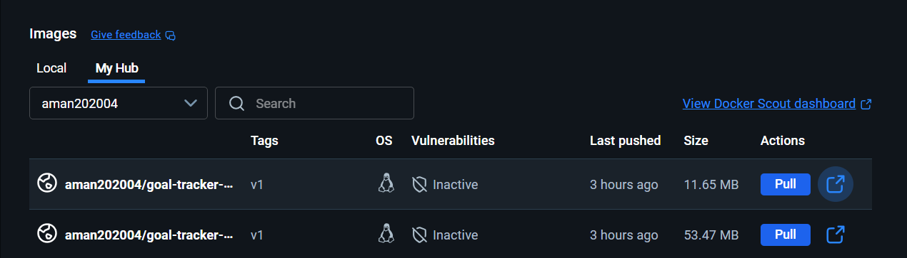

*Docker Hub showing frontend and backend repositories*

```bash
# Login to Docker Hub
docker login

# Build and push frontend
cd frontend
docker build -t YOUR_DOCKERHUB_USERNAME/goal-tracker-frontend:v1 .
docker push YOUR_DOCKERHUB_USERNAME/goal-tracker-frontend:v1

# Build and push backend
cd ../backend
docker build -t YOUR_DOCKERHUB_USERNAME/goal-tracker-backend:v1 .
docker push YOUR_DOCKERHUB_USERNAME/goal-tracker-backend:v1
```

---

### Step 3: Set Up Remote Backend (S3)

First, create the S3 bucket for storing Terraform state:

```bash
cd terraform-infra/backend-bootstrap
terraform init
terraform apply -auto-approve
```

This creates:
- S3 bucket: `goal-tracker-terraform-state`
- State locking enabled via S3 lock file

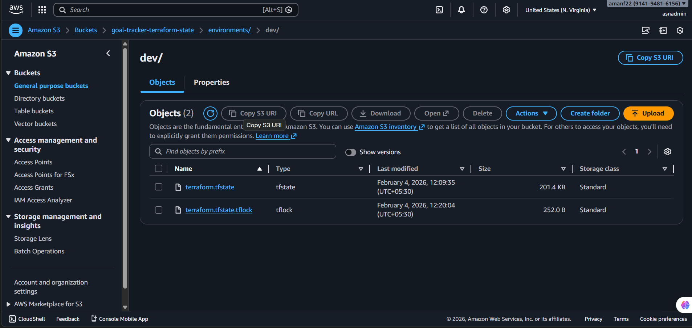

*S3 bucket storing Terraform state file for remote state management*

---

### Step 4: Configure Environment Variables

```bash
cd ../environments/dev

# Copy the example file
cp terraform.tfvars.example terraform.tfvars

# Edit with your values
nano terraform.tfvars
```

**Required Configuration:**

```hcl
# General
region      = "us-east-1"
environment = "dev"
project     = "goal-tracker"

# SSH Configuration (REQUIRED)
ssh_key_name     = "your-aws-key-name"    # Your EC2 key pair name
allowed_ssh_cidr = "YOUR_IP/32"           # Your IP for bastion access

# Docker Images (REQUIRED)
frontend_docker_image = "yourusername/goal-tracker-frontend:v1"
backend_docker_image  = "yourusername/goal-tracker-backend:v1"

# Database
db_engine_version = "17.7"
```

---

### Step 5: Initialize and Deploy with Terraform

```bash
# Initialize Terraform with remote backend
terraform init

# Review the plan
terraform plan

# Deploy infrastructure
terraform apply -auto-approve
```

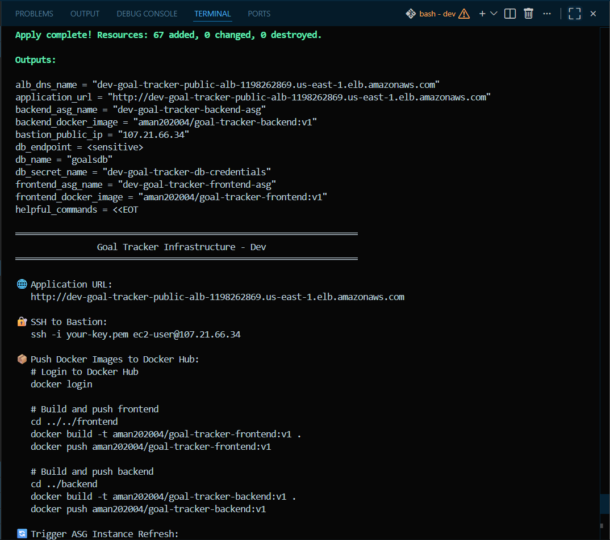

*Terraform apply showing successful resource creation*

**⏱️ Deployment Time:** Approximately 15-20 minutes

---

### Step 6: Verify Deployment

After deployment, check the AWS Console:

#### EC2 Instances
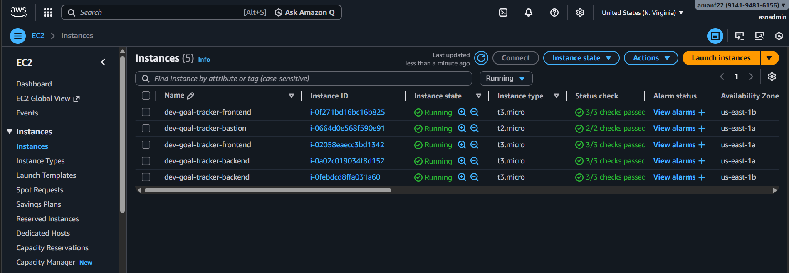

*Running EC2 instances: Bastion, Frontend ASG, Backend ASG*

#### VPC Resource Map
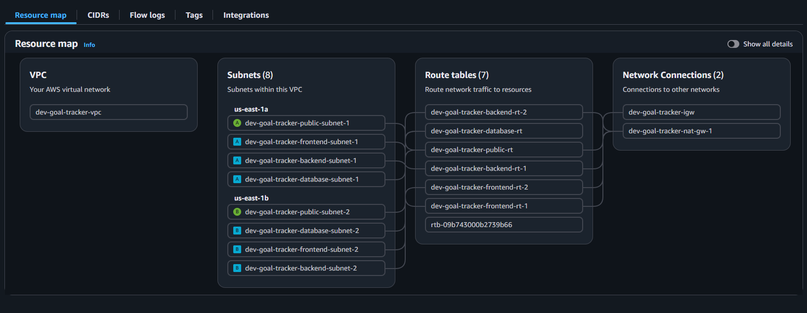

*VPC with all subnets, NAT Gateways, and routing configuration*

#### Load Balancers

**External ALB (Internet-Facing):**
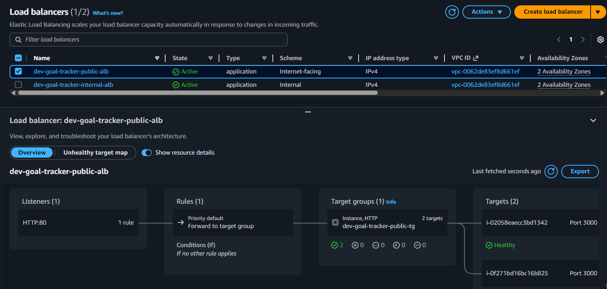

*Internet-facing ALB receiving traffic from users*

**Internal ALB:**


*Internal ALB for frontend-to-backend communication*

#### Target Groups Health

**Frontend Target Group:**
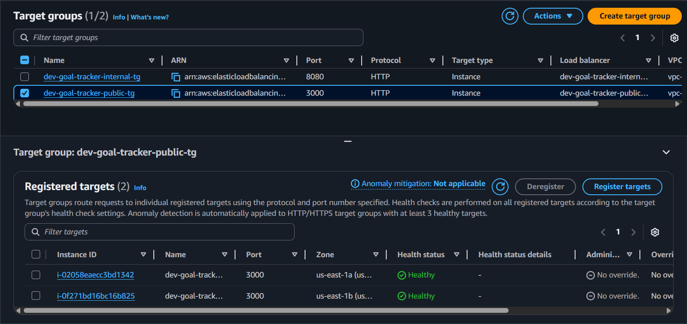

*Frontend instances showing healthy status*

**Backend Target Group:**
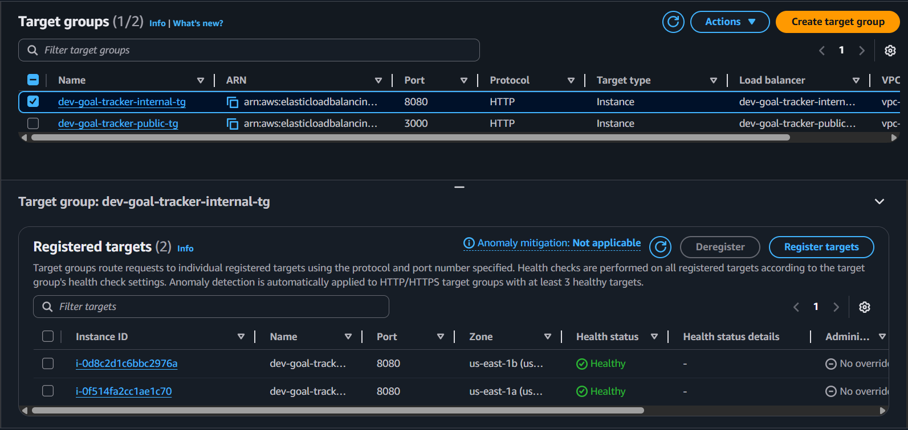

*Backend instances showing healthy status*

#### RDS Database
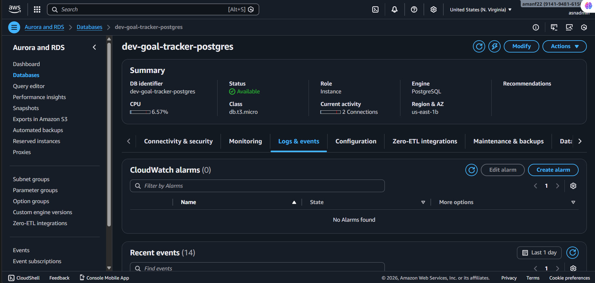

*PostgreSQL database running in private subnets*

---

### Step 7: Access the Application

```bash
# Get the application URL
terraform output application_url

# Get bastion IP for SSH access
terraform output bastion_public_ip
```

Open the ALB DNS name in your browser to access the Goal Tracker application.

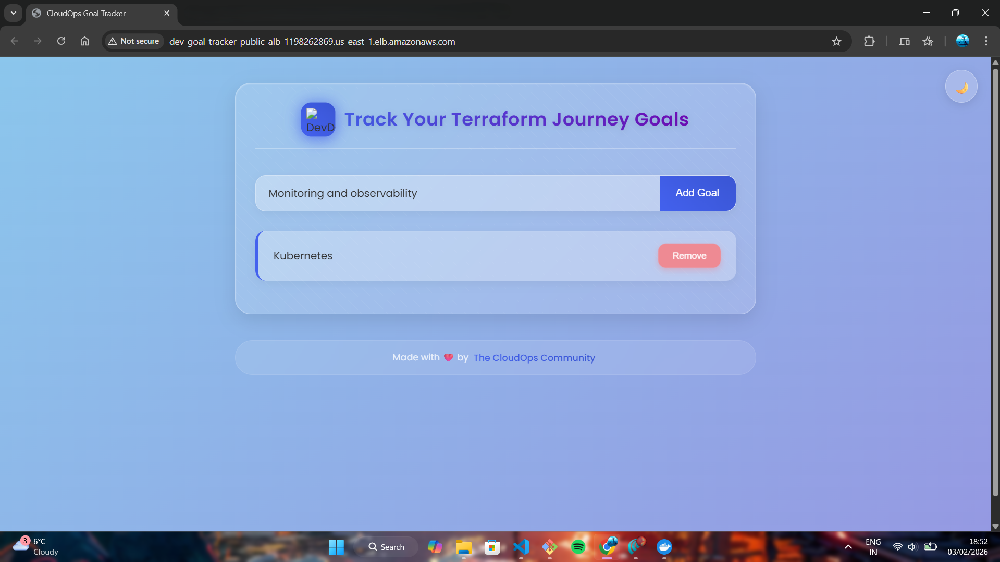

*Goal Tracker application running successfully with goals displayed*

---

## 🔄 GitHub Actions CI/CD Setup


*GitHub Actions workflow showing successful Terraform deployment*

> 💡 **Workflows are available in the repository's [Actions tab](../../actions)**. You can view run history, trigger manual deployments, and monitor workflow status directly from there.

### Configure Repository Secrets

Go to your GitHub repository → **Settings** → **Secrets and variables** → **Actions**

Add the following secrets:

| Secret Name | Description |
|-------------|-------------|
| `AWS_ACCESS_KEY_ID` | Your AWS access key |
| `AWS_SECRET_ACCESS_KEY` | Your AWS secret key |
| `TF_VAR_SSH_KEY_NAME` | EC2 key pair name (e.g., `aws-login`) |
| `TF_VAR_DB_ENGINE_VERSION` | PostgreSQL version (e.g., `17.7`) |

### Workflow Triggers

| Event | Condition | Action |
|-------|-----------|--------|
| Push to `main` | Files in `terraform-infra/**` changed | Plan + Apply |
| Pull Request to `main` | Files in `terraform-infra/**` changed | Plan only |
| Manual dispatch | Click "Run workflow" in Actions | Plan or Apply |

### Destroy Infrastructure

To destroy all resources:

1. Go to **Actions** → **Terraform Destroy**
2. Click **"Run workflow"**
3. Type `destroy` in the confirmation field
4. Click **"Run workflow"**

---

## 🔐 SSH Access to Private Instances

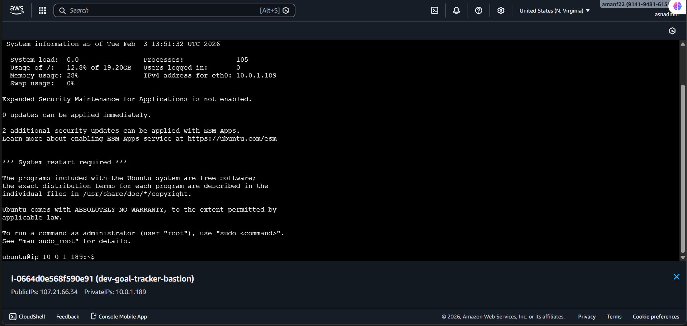

*Successfully connected to Bastion Host and accessing private instances*

### Option 1: Jump through Bastion

```bash
# SSH to Bastion first
ssh -i ~/.ssh/your-key.pem ec2-user@<BASTION_PUBLIC_IP>

# From Bastion, SSH to private instance
ssh -i ~/.ssh/your-key.pem ec2-user@<PRIVATE_INSTANCE_IP>
```

### Option 2: SSH ProxyJump (Recommended)

```bash
ssh -i ~/.ssh/your-key.pem -J ec2-user@<BASTION_IP> ec2-user@<PRIVATE_IP>
```

### Option 3: SSH Agent Forwarding

```bash
# Add key to SSH agent
ssh-add ~/.ssh/your-key.pem

# Connect with agent forwarding
ssh -A -i ~/.ssh/your-key.pem ec2-user@<BASTION_IP>

# Now you can SSH to private instances without copying the key
ssh ec2-user@<PRIVATE_IP>
```

---

## 🐛 Troubleshooting Guide

### Issue 1: RDS Parameter Group Error (Log Connections)

**Problem:**
During `terraform apply`, the RDS creation fails with:
```
InvalidParameterValue: Invalid value for log_connections
```
or
```
InvalidParameterCombination: The parameter group with DBParameterGroupFamily postgres17 can't be used
```

**Root Cause:**
The `aws_db_parameter_group` resource had a hardcoded family (`postgres17`) that didn't match the engine version specified.

**Fix:**
The RDS module was updated to dynamically set the parameter group family based on the engine version:

```hcl
locals {
  pg_major_version = split(".", var.engine_version)[0]
}

resource "aws_db_parameter_group" "main" {
  name   = "${var.environment}-${var.project}-pg${local.pg_major_version}"
  family = "postgres${local.pg_major_version}"
  # ...
}
```

---

### Issue 2: Application Not Loading (502 Bad Gateway)

**Problem:**
Accessing the External ALB DNS returns a 502 error.

**Root Cause:**
- Frontend containers may not be running
- Frontend cannot reach the Backend internal ALB
- Health checks failing

**Fix:**
1. Check Target Group health in AWS Console
2. Verify Docker image names match exactly
3. SSH to instance and check container logs:

```bash
# SSH via Bastion
ssh -A -i key.pem ec2-user@<BASTION_IP>
ssh ec2-user@<FRONTEND_PRIVATE_IP>

# Check containers
docker ps -a
docker logs <container_id>
```

---

### Issue 3: SSH Permission Denied (Public Key)

**Problem:**
Unable to SSH from Bastion Host to private instances:
```
Permission denied (publickey).
```

**Root Cause:**
The private key (`.pem` file) resides on your local machine but is not available inside the Bastion Host.

**Fix:**

**Option A - Copy key to Bastion:**
```bash
scp -i key.pem key.pem ec2-user@<BASTION_IP>:/home/ec2-user/
```

**Option B - Use SSH Agent Forwarding (Recommended):**
```bash
ssh-add ~/.ssh/key.pem
ssh -A -i key.pem ec2-user@<BASTION_IP>
```

---

### Issue 4: Missing Terraform Variables in GitHub Actions

**Problem:**
Terraform plan fails with:
```
Error: No value for required variable "ssh_key_name"
```

**Root Cause:**
The `terraform.tfvars` file is gitignored (best practice for security), so GitHub Actions doesn't have access to variable values.

**Fix:**
Add required variables as GitHub Secrets with `TF_VAR_` prefix:
- `TF_VAR_SSH_KEY_NAME`
- `TF_VAR_DB_ENGINE_VERSION`

And reference them in the workflow:
```yaml
env:
  TF_VAR_ssh_key_name: ${{ secrets.TF_VAR_SSH_KEY_NAME }}
  TF_VAR_db_engine_version: ${{ secrets.TF_VAR_DB_ENGINE_VERSION }}
```

---

## 🧹 Cleanup

To destroy all infrastructure:

### Option 1: Using GitHub Actions (Recommended)
1. Go to **Actions** → **Terraform Destroy**
2. Click "Run workflow"
3. Type `destroy` to confirm

### Option 2: Using Terraform CLI
```bash
cd terraform-infra/environments/dev
terraform destroy -auto-approve
```

---

## 📊 Cost Estimation

**Development Environment (Single NAT, No Multi-AZ):**
- NAT Gateway: ~$32/month
- EC2 Instances (6x t3.micro): ~$31/month
- ALB (2x): ~$33/month
- RDS (db.t3.micro): ~$12/month
- **Total: ~$108/month**

**Production Environment (Dual NAT, Multi-AZ RDS):**
- NAT Gateways (2x): ~$64/month
- EC2 Instances: Variable with ASG
- RDS Multi-AZ: ~$24/month
- **Total: ~$150-200/month**

---

## 🛡️ Security Best Practices Implemented

- ✅ All compute resources in private subnets
- ✅ Bastion host for secure SSH access
- ✅ Security groups with least privilege
- ✅ RDS encryption at rest
- ✅ Secrets managed via AWS Secrets Manager
- ✅ Sensitive variables passed via GitHub Secrets
- ✅ S3 backend with encryption for Terraform state

---

## 📚 Technology Stack

| Component | Technology |
|-----------|------------|
| Infrastructure as Code | Terraform 1.13+ |
| Cloud Provider | AWS (VPC, EC2, ALB, RDS, ASG) |
| Container Runtime | Docker |
| Container Registry | Docker Hub |
| Frontend | Node.js |
| Backend | Go |
| Database | PostgreSQL 17.7 |
| CI/CD | GitHub Actions |
| State Management | S3 + State Locking |

---

## 🤝 Contributing

1. Fork the repository
2. Create a feature branch (`git checkout -b feature/amazing-feature`)
3. Commit your changes (`git commit -m 'Add amazing feature'`)
4. Push to the branch (`git push origin feature/amazing-feature`)
5. Open a Pull Request

---

## 📝 License

This project is licensed under the MIT License - see the [LICENSE](LICENSE) file for details.

---

## 👤 Author

Built with ❤️ for learning DevOps and Infrastructure as Code

---

**⭐ If you found this project helpful, please give it a star!**
